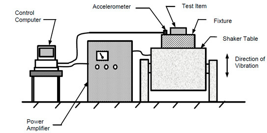

# {{cookiecutter.project_name}}

{{cookiecutter.context}}

## Details

- Author: {{cookiecutter.author}}
- Timestamp: {{cookiecutter.timestamp}}
- Intended Audience: {{cookiecutter.intended_audience}}

## Scope

{{cookiecutter.scope}}

## Test Goals

{{cookiecutter.test_goals}}

## Success Criteria

{{cookiecutter.success_criteria}}

## Test Setup

{{cookiecutter.test_setup}}

## Procedures

{{cookiecutter.procedures}}

## Safe and Precautions

::: warning
{{cookiecutter.precautions}}
:::

## Test Conditions and Environment

### Environmental Factors

{{cookiecutter.environment}}

### Configuration

{{cookiecutter.configuration}}

### Constraints and Limitations

{{cookiecutter.constraints}}

## Test Results

### Data and observations

Present raw data, logs, or measurements (e.g., voltage levels, throughput, thermal readings, pass/fail counts).

### Analysis/Interpretation

Summarize what the data indicates. Note trends, anomalies, or correlations.

### Comparisons

Compare actual results to expected values or reference performance (e.g., from the datasheet or design specs).

## Issues and Troubleshooting

### Failures & Anomalies

 List any unexpected behaviors, error codes, or hardware malfunctions.

1. first
2. second
3. third

### Root Cause Analysis

Discuss potential reasons for failures.

1. first
2. second
3. third

### Mitigation Steps

Suggest quick fixes, design revisions, or process changes to address the identified issues.

1. first
2. second
3. third

## Conclusions

### Summary of Findings

Recap the most critical outcomes or discoveries from the test.

### Recommendations

Provide guidance on next steps—e.g., further testing, design adjustments, or production readiness.

### Limitations & Future Work

Note any untested scenarios or recommended additional tests (e.g., long-term endurance, different environmental conditions).
